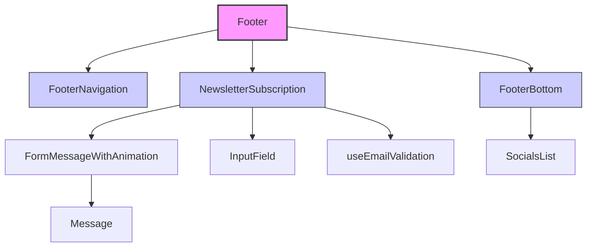

# План декомпозиции компонента Footer

## Текущее состояние

Компонент `Footer` (`layouts/footer/Footer.tsx`) выполняет следующие функции:
1. Отображение навигационных ссылок
2. Управление формой подписки на рассылку
3. Валидация email
4. Обработка отправки формы (имитация)
5. Отображение сообщений об ошибках и успехе с анимацией
6. Отображение копирайта и социальных сетей

**Проблемы:**
- Нарушение принципа единой ответственности (SRP)
- Высокая связанность логики и представления
- Сложность тестирования
- Повторное использование компонентов затруднено

## Предлагаемая декомпозиция

### 1. FooterNavigation
**Назначение:** Отображение навигационных ссылок в подвале
**Пропсы:**
- `links`: Array<{ href: string; label: string }>
- `className?`: string

**Логика:** Простой компонент без состояния, отображает список ссылок через `next/link`

### 2. NewsletterSubscription
**Назначение:** Форма подписки на рассылку с валидацией и состоянием
**Пропсы:**
- `onSubmit?`: (email: string) => Promise<void> | void
- `initialEmail?`: string
- `className?`: string
- `inputId?`: string

**Логика:**
- Управление состоянием email, ошибки, отправки
- Валидация email (можно вынести в хук)
- Обработка отправки формы
- Отображение инпута и кнопки
- Интеграция с анимацией сообщений

### 3. FormMessageWithAnimation
**Назначение:** Отображение сообщений с анимацией появления/исчезновения
**Пропсы:**
- `message`: string
- `type`: 'error' | 'success'
- `isVisible`: boolean
- `animation?`: объект анимации framer-motion
- `className?`: string

**Логика:** Обёртка над существующим компонентом `Message` с добавлением `AnimatePresence` и `motion.div`

### 4. FooterBottom
**Назначение:** Нижняя часть футера с копирайтом и социальными сетями
**Пропсы:**
- `copyrightText?`: string
- `showSocials?`: boolean
- `className?`: string

**Логика:** Отображение текста копирайта и компонента `SocialsList`

### 5. useEmailValidation
**Назначение:** Хук для валидации email и управления состоянием
**Возвращает:**
- `email`: string
- `setEmail`: (email: string) => void
- `error`: string
- `validate`: () => boolean
- `reset`: () => void

## Диаграмма компонентов

## Преимущества декомпозиции

1. **Улучшенная поддерживаемость** – каждый компонент отвечает за одну задачу
2. **Повторное использование** – `NewsletterSubscription` можно использовать в других местах
3. **Упрощённое тестирование** – компоненты можно тестировать изолированно
4. **Гибкость** – легче вносить изменения в отдельные части
5. **Соблюдение принципов SOLID** – SRP, открытость/закрытость

## Миграционный план

1. Создать новые компоненты с интерфейсами
2. Постепенно заменять части Footer на новые компоненты
3. Сохранить обратную совместимость (стили, поведение)
4. Протестировать каждую часть
5. Удалить старый код из Footer после полной миграции

## Риски и смягчение

- **Разрыв стилей** – использовать те же CSS-классы или импортировать стили из Footer.module.css
- **Потеря анимаций** – сохранить анимации framer-motion в новых компонентах
- **Усложнение пропсов** – тщательно продумать интерфейсы для минимизации пропсов

## Следующие шаги

1. Создать файловую структуру для новых компонентов
2. Реализовать компоненты по одному
3. Интегрировать в существующий Footer
4. Протестировать функциональность
5. Документировать изменения