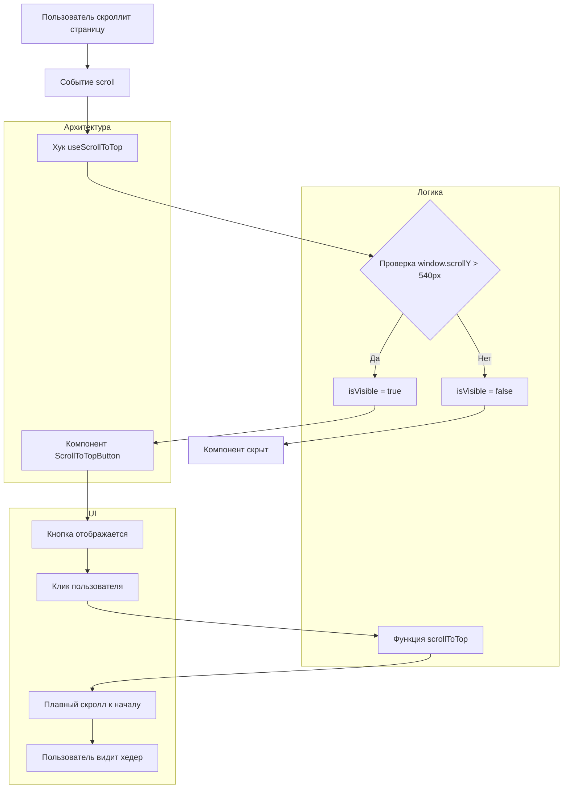

# План внедрения фичи "Кнопка возврата к хедеру"

## Описание фичи
Пользователь должен иметь возможность быстро вернуться к началу страницы (хедеру) при прокрутке вниз. Кнопка в виде стрелочки появляется только когда пользователь проскролил хотя бы 540 пикселей от хедера.

## Архитектурное решение



### Компонентная архитектура

### 1. Компоненты
- **`ScrollToTopButton`** - основной компонент кнопки
- **`useScrollToTop`** - кастомный хук для логики скролла

### 2. Структура файлов
```
components/
  scrollToTop/
    ScrollToTopButton.tsx          # Основной компонент
    ScrollToTopButton.module.css   # Стили компонента
    ScrollToTopButton.interface.ts # Интерфейсы пропсов
hooks/
  useScrollToTop.tsx               # Хук для отслеживания скролла
```

### 3. Детали реализации

#### Хук `useScrollToTop`
```typescript
interface UseScrollToTopReturn {
  isVisible: boolean;
  scrollToTop: () => void;
}

const useScrollToTop = (threshold: number = 540): UseScrollToTopReturn
```

**Логика:**
- Отслеживает событие `scroll` на window
- Вычисляет текущую позицию скролла (`window.scrollY`)
- Сравнивает с порогом (540px)
- Возвращает `isVisible: boolean`
- Предоставляет функцию `scrollToTop` для плавного скролла к началу

#### Компонент `ScrollToTopButton`
```typescript
interface ScrollToTopButtonProps {
  threshold?: number;          // Порог появления (по умолчанию 540)
  className?: string;          // Дополнительные CSS классы
  icon?: ReactNode;           // Кастомная иконка (опционально)
}
```

**Функциональность:**
- Использует хук `useScrollToTop`
- Рендерится условно при `isVisible === true`
- Имеет плавные анимации появления/исчезновения с помощью Framer Motion
- Поддерживает клавиатурную навигацию (tabindex, aria-label)
- Имеет обработчик клика для скролла к началу

### 4. Стилизация
- Позиционирование: fixed в правом нижнем углу
- Размеры: 48x48px (доступный размер для касания)
- Цвета: в соответствии с дизайн-системой проекта
- Анимации: fade-in/fade-out с transform Framer Motion
- Иконка: стрелка вверх (можно использовать существующую или добавить новую)

### 5. Интеграция
- Компонент добавляется в `app/layout.tsx` после `</Footer>`
- Не требует изменения существующей логики
- Работает на всех страницах автоматически

### 6. Доступность (a11y)
- `aria-label="Вернуться к началу страницы"`
- `role="button"`
- `tabIndex={0}` для клавиатурной навигации
- Поддержка клавиш Enter/Space
- Фокус-стили для визуального выделения

### 7. Тестирование
- Проверка появления при скролле > 540px
- Проверка скрытия при скролле < 540px
- Проверка плавного скролла к началу
- Проверка клавиатурной навигации
- Проверка на мобильных устройствах

### 8. Порядок реализации
1. Создать интерфейсы в `ScrollToTopButton.interface.ts`
2. Создать хук `useScrollToTop.tsx`
3. Создать компонент `ScrollToTopButton.tsx` со стилями
4. Добавить иконку стрелки в `public/` (или использовать существующую)
5. Интегрировать компонент в `app/layout.tsx`

### 9. Возможные улучшения
- Настройка порога через конфиг
- Кастомизация анимаций
- Разные варианты иконок
- Показ прогресса скролла
- Дебаунс для оптимизации производительности

## Технические требования
- TypeScript с строгой типизацией
- CSS Modules для стилей
- Поддержка React 19 и Next.js 15
- Соответствие правилам проекта (комментарии на русском, структура папок)